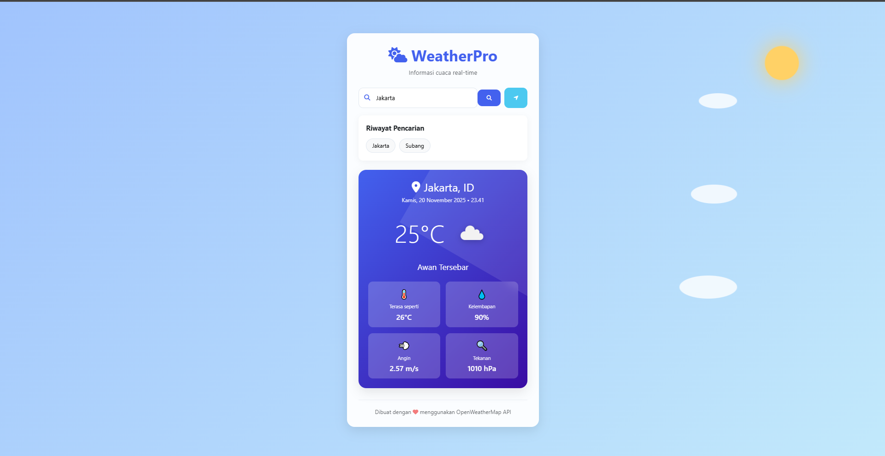

# 🌤️ Weather App

Aplikasi cuaca sederhana dan responsif yang menampilkan informasi cuaca real-time dari berbagai kota di seluruh dunia.


## ✨ Fitur

- 🔍 **Pencarian Kota** - Cari cuaca berdasarkan nama kota
- 🌡️ **Informasi Suhu** - Tampilan suhu dalam Celsius
- 💧 **Kelembapan** - Informasi tingkat kelembapan udara
- 💨 **Kecepatan Angin** - Data kecepatan angin real-time
- 🎨 **Tampilan Responsif** - Beradaptasi dengan desktop dan mobile
- 🌐 **Multi-language** - Deskripsi cuaca dalam bahasa Indonesia

## 🚀 Demo

Aplikasi dapat diakses di: **[https://robbyalijuliansyah.github.io/Weather-App](https://robbyalijuliansyah.github.io/Weather-App)**


## 📸 Screenshot

![Weather App Screenshot]
    

## 🛠️ Teknologi

- **HTML5** - Struktur halaman
- **CSS3** - Styling dan layout responsif
- **JavaScript ES6** - Logika aplikasi dan API calls
- **OpenWeatherMap API** - Data cuaca real-time

## 📁 Struktur Project
weather-app/
<br>
├── index.html # File utama HTML
<br>
├── style.css # Stylesheet untuk styling
<br>
├── script.js # JavaScript logic
<br>
└── README.md # Dokumentasi ini
<br>
└── image.png # Tampilan Weather-App


## 🔧 Instalasi & Penggunaan

### 1. Clone Repository
```bash
git clone https://github.com/robbyalijuliansyah/Weather-App.git
cd Weather-App
```

### 2. Setup API Key
1. Daftar di **[OpenWeatherMap API](https://openweathermap.org/api)**
2. Dapatkan API Key gratis
3. Buka file script.js
4. Ganti YOUR_API_KEY_HERE dengan API Key Anda:
```
javascript
const API_KEY = 'your_actual_api_key_here';
```

### 3. Jalankan Aplikasi
Buka file index.html di browser atau gunakan live server:
```
bash
# Jika memiliki live server extension
live-server

# Atau langsung buka file di browser
```
open index.html

## 🎯 Cara Menggunakan
1. Buka aplikasi di browser
2. Masukkan nama kota di kolom pencarian
3. Klik "Cari" atau tekan Enter
4. Lihat informasi cuaca yang ditampilkan

## Contoh Pencarian:
- Jakarta
- Surabaya
- Bandung
- Bali
- London
- New York

## 🌐 API yang Digunakan
Aplikasi menggunakan **[OpenWeatherMap API](https://openweathermap.org/api)** untuk:
- Data cuaca current
- Ikon kondisi cuaca
- Informasi tambahan (kelembapan, angin, dll)

## 📱 Responsive Design
Aplikasi dioptimalkan untuk:
- ✅ Desktop (1024px+)
- ✅ Tablet (768px - 1024px)
- ✅ Mobile (< 768px)

## 🛠️ Teknologi yang Digunakan
- HTML5 - Struktur website
- CSS3 - Styling dan layout responsif
- JavaScript - Logika aplikasi dan API calls
- OpenWeatherMap API - Data cuaca real-time

## 📁 Struktur Project
```
text
Weather-App/
├── index.html          # File utama HTML
├── style.css           # Stylesheet untuk styling
├── script.js           # JavaScript logic
└── README.md           # Dokumentasi ini
```

## 🐛 Troubleshooting
### Masalah Umum:
1. Kota tidak ditemukan
    - Pastikan ejaan nama kota benar
    - Gunakan nama kota dalam bahasa Inggris
2. API Key error
    - Pastikan API Key sudah diatur
    - Tunggu beberapa jam setelah registrasi (aktivasi API Key)
3. Tampilan tidak responsif
    - Clear cache browser
    - Refresh halaman

## 🤝 Berkontribusi
Kontribusi selalu diterima! Ikuti langkah:

Fork project

Buat feature branch (git checkout -b feature/AmazingFeature)

Commit changes (git commit -m 'Add some AmazingFeature')

Push to branch (git push origin feature/AmazingFeature)

Open Pull Request

📄 Lisensi
Distributed under the MIT License. See LICENSE for more information.

👨‍💻 Developer
Dibuat dengan ❤️ oleh Robby Ali Juliansyah

GitHub: @robbyalijuliansyah

Email: robbyalijuliansyah05@gmail.com

🙏 Acknowledgments
OpenWeatherMap untuk API cuaca

Font Awesome untuk ikon

Shields.io untuk badges


⭐ Jangan lupa beri star jika project ini membantu!
